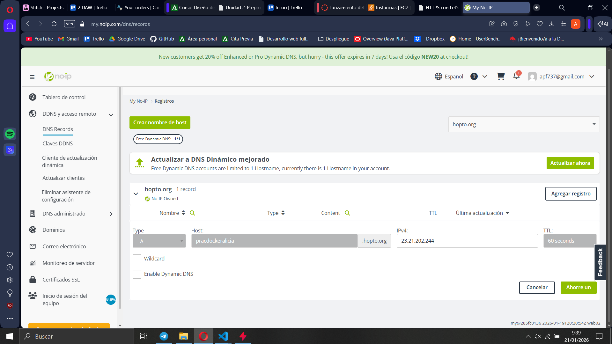
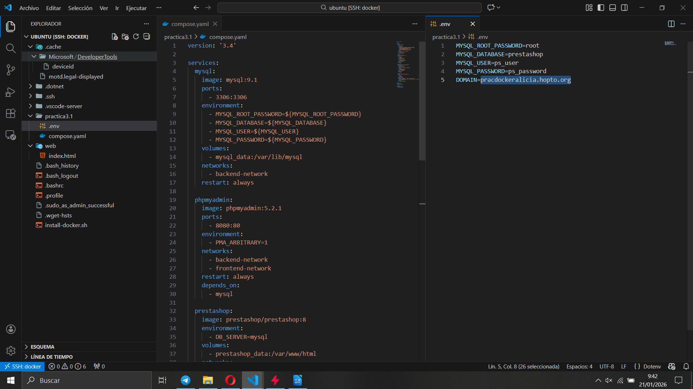
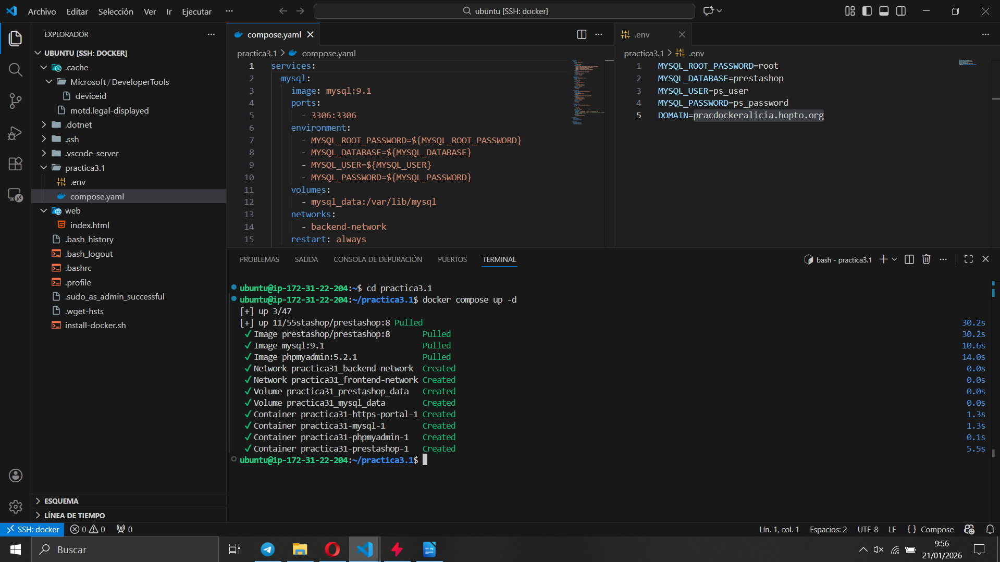
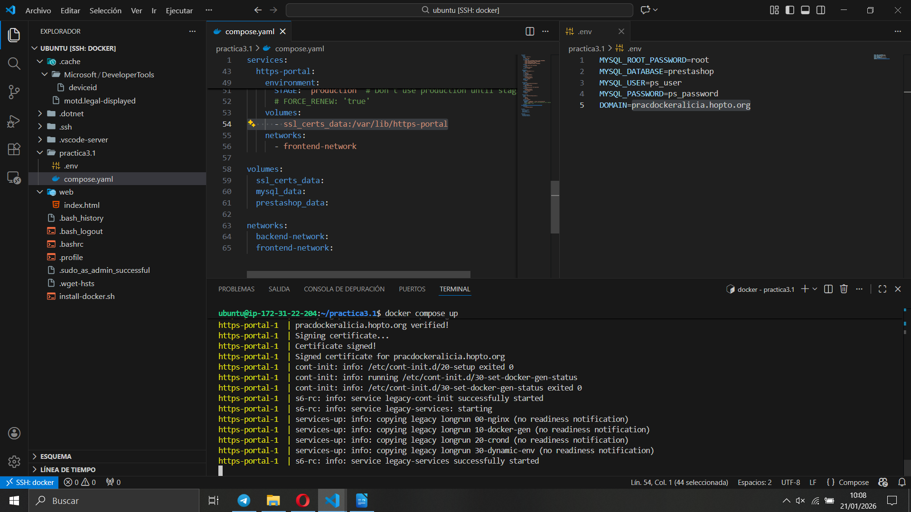
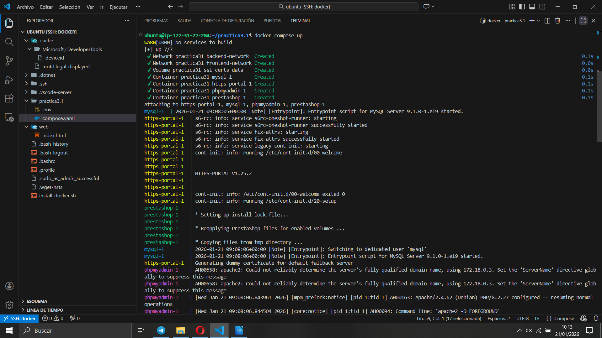
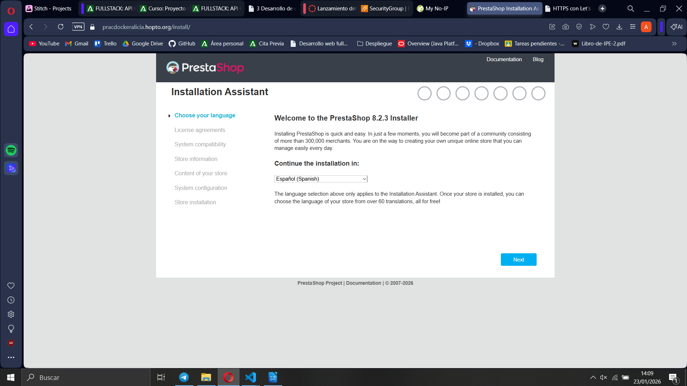
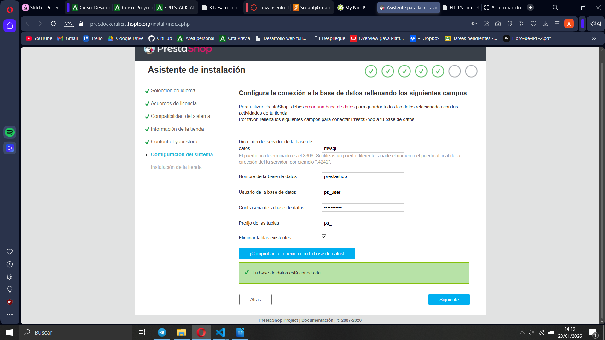

# Práctica 3.1 - Despliegue con Docker Compose

> **Resumen**: Este repositorio contiene un ejemplo de despliegue de una tienda PrestaShop con MySQL, phpMyAdmin y un proxy HTTPS usando `docker-compose`. Se incluyen los archivos de configuración necesarios (`compose.yaml` y `.env`) así como instrucciones para levantar el entorno desde cero.

## 📁 Estructura del proyecto
```
practica3.1/
├── compose.yaml        # definiciones de servicios docker
├── .env                # variables de entorno sensibles
└── README.md           # este fichero
```

> El PDF adjunto en el repo (`3.1.pdf`) documenta la práctica y explica los pasos de manera más extensa.

## 🔧 Requisitos previos
- Docker y Docker Compose instalados en el sistema.
- Tener acceso a una terminal de Linux (se probó en Ubuntu).

## 📄 Configuración
1. Copia el archivo `.env` y rellena las variables si deseas cambiarlas:
   ```dotenv
   MYSQL_ROOT_PASSWORD=root
   MYSQL_DATABASE=prestashop
   MYSQL_USER=ps_user
   MYSQL_PASSWORD=ps_password
   DOMAIN=pracdockeralicia.hopto.org
   ```
   - `DOMAIN` se usa por el proxy HTTPS (https-portal) para generar certificados.
   - Si sólo experimentas en local puedes dejar cualquier valor y omitir el proxy.

2. El `compose.yaml` contiene cuatro servicios:
   - `mysql`: base de datos MySQL 9.1 con datos persistentes en un volumen.
   - `phpmyadmin`: interfaz web para gestionar MySQL.
   - `prestashop`: imagen oficial de PrestaShop 8 conectada a `mysql`.
   - `https-portal`: proxy con certificados auto-renovables que dirige el dominio al contenedor de PrestaShop.

   Los servicios se comunican a través de dos redes (`backend-network` y `frontend-network`) y utilizan volúmenes declarados al final del archivo.

## 🚀 Levantar el entorno
Desde la carpeta `practica3.1`:
```bash
export $(grep -v '^#' .env | xargs)   # carga variables de entorno
docker compose up -d                     # inicia contenedores en segundo plano
```
- `docker compose ps` muestra el estado de los servicios.
- `docker compose logs -f prestashop` permite seguir la inicialización.

Una vez estén todos los contenedores `healthy`:
- Accede a PrestaShop en `http://localhost` (o `https://<DOMAIN>` si el proxy está activo).
- phpMyAdmin queda disponible en `http://localhost:8080`.

Primero, creamos una IP mediante algun tipo de servicio, en este caso será No-IP


La IP será la IP publica de nuestra instancia en WSL. Creamos entonces un compose.yaml con los datos proporcionados, asi como un .env en el cual pondremos en domain el nombre de nuestro host creado en No-IP


Y lo lanzamos con un docker compose up -d


Hemos tenido que hacer un docker compose down porque faltan los certificados asi que añadimos las siguientes lineas en https-portal:
volumes:
- ssl_certs_data:/var/lib/https-portal

y en volumes añadimos la siguiente linea:
ss_certs_data:

Para añadir de esta forma los certificados y volvemos a hacer un docker compose up



Y ahora si accedemos al dominio en un navegador


Vamos rellenando los campos y aceptando, pero en la siguiente ventana, cambiamos los datos por los que tenemos en el usuario y password del .env


Y finalmente si al terminar nos volvemos a dirigir a la pagina, tendremos nuestra PrestaShop levantada


## 🗂 Datos persistentes
Los volúmenes definidos en el `compose.yaml` mantienen:
- `mysql_data`: ficheros de la base de datos.
- `prestashop_data`: código y subida de archivos de PrestaShop.
- `ssl_certs_data`: certificados generados por https-portal.

Eliminar los contenedores (`docker compose down`) no borra los volúmenes.

## 📝 Notas adicionales
- El PDF incluido describe el proceso paso a paso y justifica las decisiones de la práctica. Sirve como complemento para quien quiera rehacer el ejercicio de cero.
- Puedes adaptar el dominio y las credenciales según tu entorno.

## 📦 Limpieza
Para parar y eliminar todo (contenedores, redes y volúmenes):
```bash
docker compose down --volumes --remove-orphans
```

---